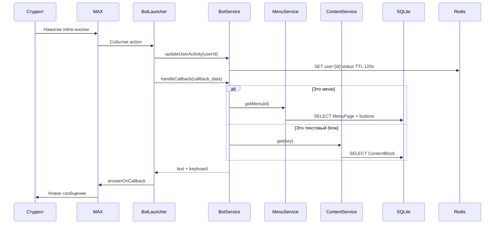
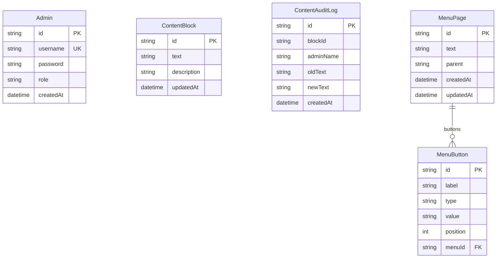

# Документация проекта rinh-max-bot

Полное описание для разработчиков и защиты дипломного проекта.  
[Быстрый старт →](../README.md)

---

## 1. Общий аудит проекта (кратко)

### Сильные стороны

- **Чёткое разделение слоёв:** Controller / Bot → Service → Repository → Prisma — проще тестировать и менять хранилище.
- **Единый источник правды:** SQLite + Prisma; JSON только при `db:seed`.
- **Безопасность админки:** bcrypt для паролей, `timingSafeEqual` для суперадмина из `.env`, rate limit на `/admin/login`, helmet, httpOnly-сессии.
- **Аудит контента:** таблица `ContentAuditLog` вместо файла `changes.log`.
- **Модульность NestJS:** Bot, Admin, Content изолированы; `SharedModule` устраняет дубли `MenuService`.
- **Тесты:** unit-тесты для сервисов, репозиториев, seed.
- **Docker:** compose с Redis, миграции и seed при старте.

### Слабые стороны и риски

- **SQLite** — одна запись в файл; при высокой параллельной записи возможны блокировки.
- **Нет очередей** — тяжёлая работа в том же процессе, что и HTTP и бот.
- **Сессии в памяти** (дефолт `express-session`) — при нескольких инстансах нужен Redis store.
- **Статистика Redis:** `SCAN` по ключам `user:*:status` — при десятках тысяч ключей станет медленнее.
- **Legacy:** `src/admin/admin.html` и копирование в Dockerfile — можно удалить после полного перехода на Vue.
- **Нагрузочные тесты** в репозитории не зафиксированы — оценки ниже теоретические.

### Архитектура и SOLID

| Принцип | Как проявляется |
|---------|------------------|
| **S** | `BotService` — ответы боту; `ContentService` — тексты; `MenuService` — дерево меню |
| **O** | Новые типы кнопок — расширение `MenuButton.type` и логики в `buildMenuResponse` |
| **L** | Репозитории за интерфейсом Prisma, подмена в тестах |
| **I** | Узкие API: guards только проверяют роль |
| **D** | Сервисы зависят от репозиториев, не от `fs` |

**Вывод:** для дипломного/среднего продакшена структура **соответствует практикам NestJS**. Для крупного трафика нужны PostgreSQL, session store и, при необходимости, вынос бота в отдельный worker.

### Рекомендации

1. Подключить `connect-redis` для сессий при горизонтальном масштабировании.
2. Заменить `SCAN` на Redis `HLL` / счётчик с TTL для активных пользователей.
3. Добавить health-check (`/health`) для Docker/K8s.
4. Провести k6/Artillery на 500–1000 виртуальных пользователей и зафиксировать цифры.

---

## 2. Стек технологий

| Технология | Роль | Почему выбрана |
|------------|------|----------------|
| **TypeScript** | Язык | Типы, единый стек с Nest и Vue |
| **NestJS 11** | Backend-фреймворк | Модули, DI, guards, экосистема |
| **@maxhub/max-bot-api** | Клиент MAX | Официальный SDK мессенджера |
| **Prisma 7** | ORM | Миграции, типобезопасные запросы |
| **SQLite** (+ better-sqlite3) | Основная БД | Нулевая настройка, файл `dev.db`, достаточно для read-heavy бота |
| **Redis** (ioredis) | Кэш активности | TTL-ключи «кто онлайн», быстрый доступ |
| **express-session** | Сессии админки | Простая cookie-авторизация без JWT |
| **bcryptjs** | Хэши паролей | Стандарт для хранения паролей |
| **Vue 3 + Vite** | Админ SPA | Реактивный UI, отдельная сборка |
| **Helmet, express-rate-limit** | Безопасность HTTP | Заголовки и защита от брутфорса |
| **Jest** | Тесты | Принят в Nest-проектах |
| **Docker Compose** | Деплой | App + Redis одной командой |

**Не используются:** GraphQL, WebSocket для админки, Kafka/RabbitMQ, PostgreSQL (но Prisma позволяет сменить `provider`).

---

## 3. README

Актуальный файл: [README.md](../README.md).

---

## 4. Устройство системы (для новичка)

### Крупные части

1. **Мессенджер MAX** — студенты общаются с ботом.
2. **Backend (NestJS)** — один процесс Node.js на порту `PORT`.
3. **SQLite** — меню, тексты, администраторы.
4. **Redis** — «кто был активен в последние 2 минуты».
5. **Админ-панель (Vue)** — статика с `/admin`, API — JSON по REST.

### Где что запускается

| Режим | Бот + API | Админ UI |
|-------|-----------|----------|
| **Разработка** | `npm run start:dev` → `localhost:PORT` | Собранный UI из `dist/admin-ui` или `npm run admin:dev` (:5173) |
| **Production** | `node dist/main.js` или Docker | Файлы из `dist/admin-ui` |

Обмен: **REST + cookie-сессии** (`fetch` с `credentials: 'include'`). Бот — **не HTTP от студента**, а SDK MAX (long polling / webhook к API MAX).

### Сценарий: студент нажимает кнопку в MAX

### Сценарий: администратор меняет текст

1. Браузер → `POST /admin/login` (логин/пароль).
2. Сервер проверяет bcrypt / суперадмин из `.env`, пишет `req.session.role`.
3. `PUT /admin/api/content/:key` с JSON `{ "value": "..." }`.
4. `ContentService` → `ContentRepository.upsertWithAudit` → SQLite + строка в `ContentAuditLog`.
5. Следующий студент в боте получает **новый текст** без перезапуска.

### Модули backend

- **bot** — диалог, клавиатуры, активность в Redis.
- **admin** — авторизация, CRUD API, отдача SPA.
- **content** — ключ–значение текстов.
- **stats** — подсчёт активных по Redis.
- **prisma** — подключение к БД, seed.

**Связи:** прямые вызовы через DI (не event bus). `AdminModule` импортирует `BotModule` для `StatsService`. `BotModule` → `ContentModule`, `MenuService` из `SharedModule`.

---

## 5. Информационное обеспечение

### Входная информация

| Источник | Данные | Формат / валидация |
|----------|--------|-------------------|
| MAX | `callback_data`, `user_id`, имя | Строки от SDK; пустой callback игнорируется |
| Админ login | `username`, `password` | JSON body; 400 если пусто |
| API контента | `key`, `value` | `ValidationPipe`; ключ не пустой |
| API меню | `id`, `text`, `parent`, кнопки | `BadRequestException` в сервисе |
| Seed | `data/*.json` | Однократный импорт при `db:seed` |

### Выходная информация

| Потребитель | Выход |
|-------------|--------|
| Студент | Markdown-сообщения + inline-клавиатура в MAX |
| Админ SPA | JSON `{ ok: true }`, списки меню/контента/админов |
| Ошибки | JSON `{ ok: false, statusCode, error, path }` через `HttpExceptionFilter` |

### Справочная (эталонная) информация

- **Дерево меню** — `MenuPage` + `MenuButton` (иерархия `parent`, порядок `position`).
- **Тексты разделов** — `ContentBlock.id` как ключ (например `library_info`).
- **Роли** — `admin` / `superAdmin` (суперадмин также из `.env`).
- **Начальное наполнение** — JSON в `data/` или `default-menus.ts`.

Обновление: через админку (runtime) или seed (только при развёртывании).

### Промежуточная информация

| Хранилище | Что | Зачем |
|-----------|-----|--------|
| **Redis** `user:{id}:status` | TTL 120 с | Счётчик «активных» в админке |
| **express-session** | `role`, `username` | Авторизация без повторного логина |
| **Память процесса** | Состояние бота MAX SDK | Текущее подключение к API |

Очередей и временных таблиц нет.

---

## 6. Логическая схема БД

**Связи:** `MenuButton.menuId` → `MenuPage.id` (CASCADE при удалении страницы). Остальные сущности независимы.

**Индексы:** `ContentAuditLog(blockId)`, `ContentAuditLog(createdAt)` — выборка истории по блоку и по времени.

**Почему SQLite:** мало админов, много чтений от бота, один инстанс приложения, простой деплой. **Миграция:** смена `provider` в Prisma на `postgresql` без переписывания сервисов.

---

## 7. Обоснование решений по данным

### Структура БД

- **Нормализация меню** (отдельная таблица кнопок) — удобное редактирование порядка и типа (`callback` / `url`).
- **ContentBlock по ключу** — совпадает с бывшим `content.json`, простой lookup для бота.
- **Audit log отдельно** — история не раздувает основную таблицу.

### Redis vs сессии в БД

- Активность пользователей **эфемерна** (2 минуты) — Redis с TTL идеален.
- Сессии админов **редки и малы** — cookie-session достаточно; при масштабировании — Redis store.

### Целостность

- Prisma транзакции в `upsertWithAudit`.
- FK `MenuButton` → `MenuPage` с `onDelete: Cascade`.
- Уникальный `Admin.username`.

---

## 8. Производительность и нагрузка

*Оценки без формального load test; основаны на архитектуре.*

### 500 одновременных «активных» студентов

**Скорее да**, если это 500 пользователей, периодически нажимающих кнопки (не 500 RPS на запись).

- Чтение меню/контента: простые SELECT, миллисекунды на SQLite при индексе по PK.
- Запись Redis: O(1) на пользователя.
- Узкое место: **один поток записи SQLite** при массовых одновременных UPDATE из админки (редко).

### До 1000

**Возможно** при преимущественно чтении и одном инстансе. Риски:

- Блокировки SQLite при конкурентной записи.
- `SCAN` Redis при очень большом числе ключей.
- CPU на формирование клавиатур (лёгкая логика).

### Типовое время отклика (ожидание)

| Операция | Порядок |
|----------|---------|
| `handleCallback` (чтение) | 5–50 ms + сеть MAX |
| `PUT content` | 10–100 ms |
| `GET /admin/api/menus` | 10–80 ms (всё дерево) |
| Login | 100–300 ms (bcrypt) |

### При перегрузке

- Таймауты клиента MAX / HTTP 503 если процесс забит.
- Rate limit на login: 20 попыток / 15 мин.
- Redis недоступен → ошибки `updateUserActivity` / stats (нужен graceful degrade).

### Масштабирование

| Подход | Когда |
|--------|--------|
| **Вертикальное** | Больше CPU/RAM одному контейнеру |
| **PostgreSQL** | Много записей, несколько инстансов API |
| **Redis session store** | Несколько реплик Nest |
| **Очередь (Bull)** | Тяжёлые фоновые задачи |
| **Отдельный worker для бота** | Изоляция long-poll от HTTP |

Кэширование контента в Redis (опционально) снизит нагрузку на SQLite при тысячах одинаковых запросов.

---

## 9. Итоговое резюме

**Хорошо:** модульная архитектура, миграция с JSON на БД, аудит, безопасность входа в админку, Vue-панель, Docker, тесты.

**Доработать:** нагрузочные тесты, Redis для сессий при scale-out, оптимизация stats, удаление legacy HTML, при росте — PostgreSQL.

**Для защиты диплома:** акцент на разделение ответственности, сценарии данных (раздел 4–5), обоснование SQLite для текущей нагрузки и план перехода на PostgreSQL при росте.
